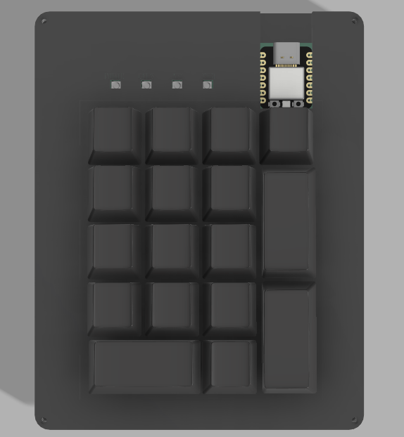
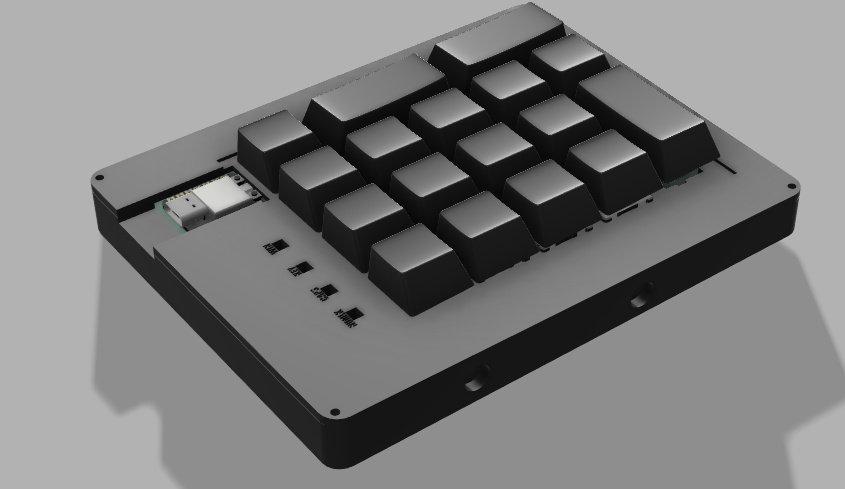
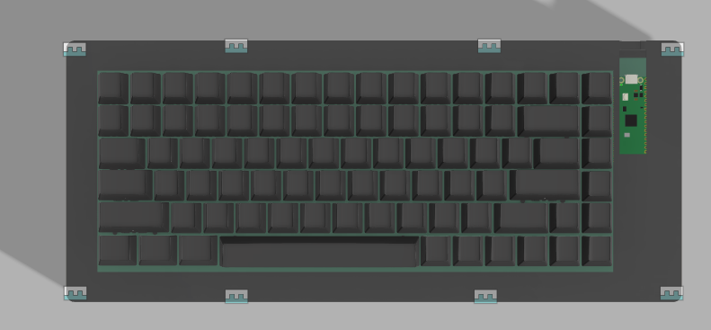
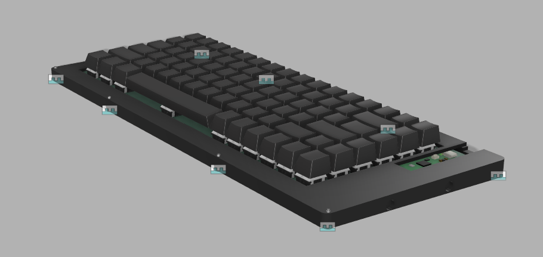
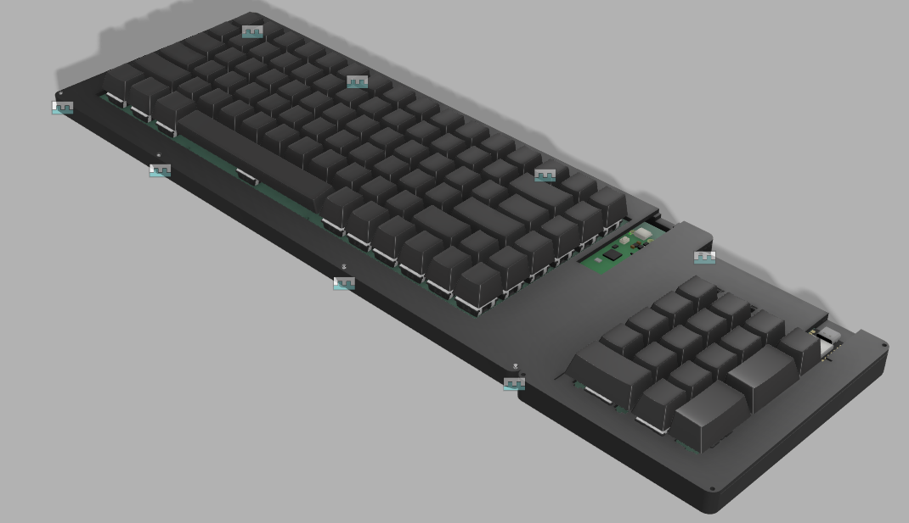
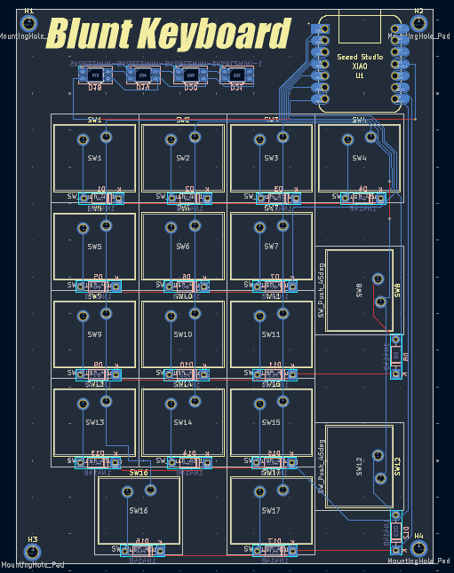
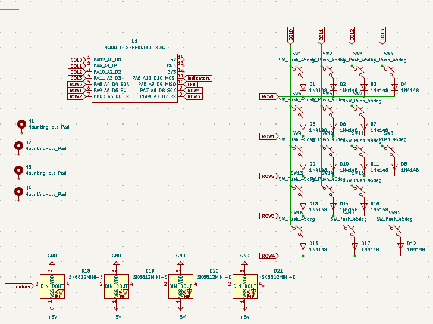
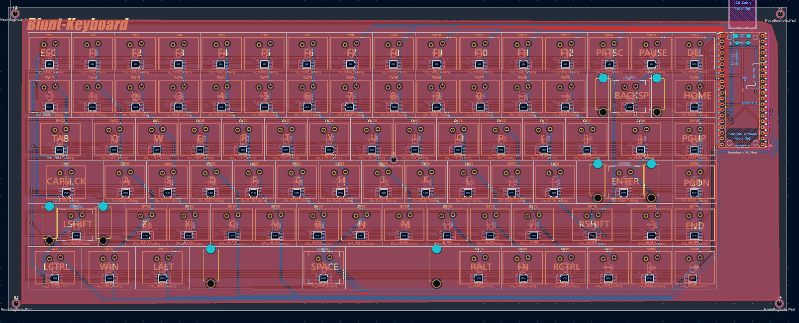
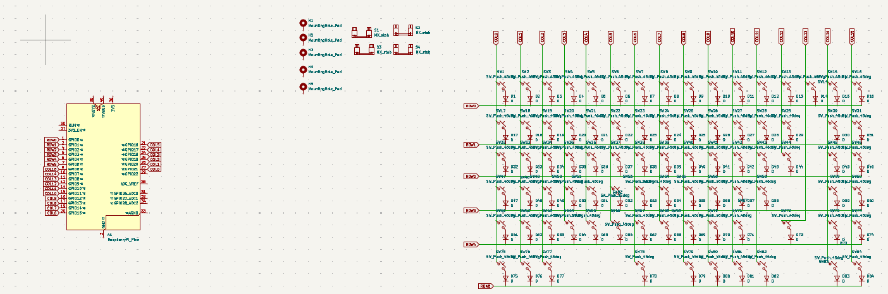
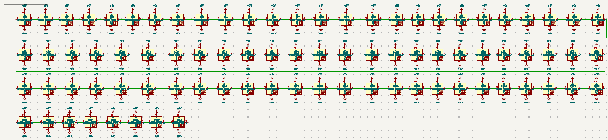

# Blunt-Keyboard

A 75% keyboard made from scratch with a magnetic attatchable numpad
### Numpad Render

### Main Keyboard Render

### Full Assembled Render

### PCB Layout Pad

### Pad Schematic

### Main PCB Layout

### Main Schematic

### Bill of Materials
