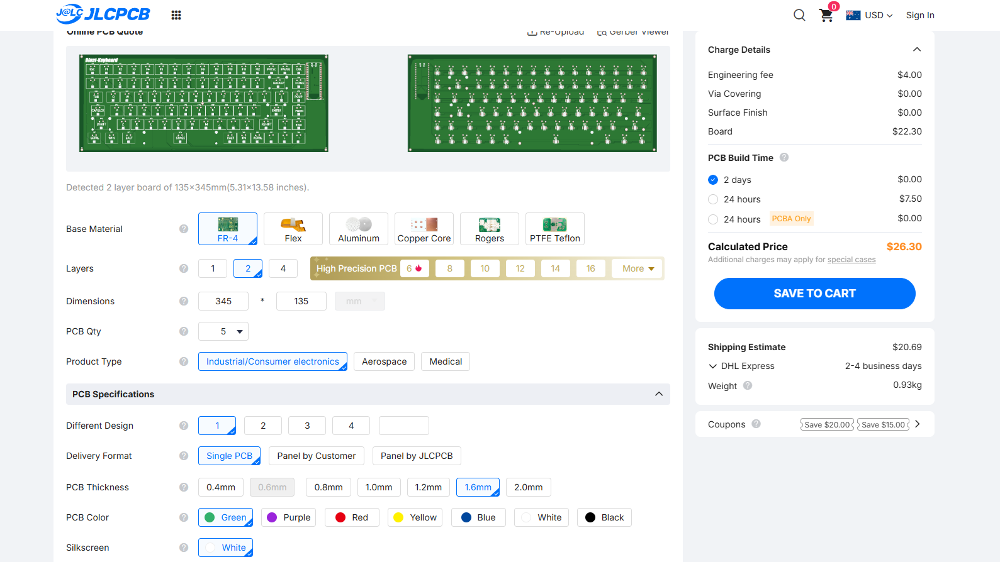
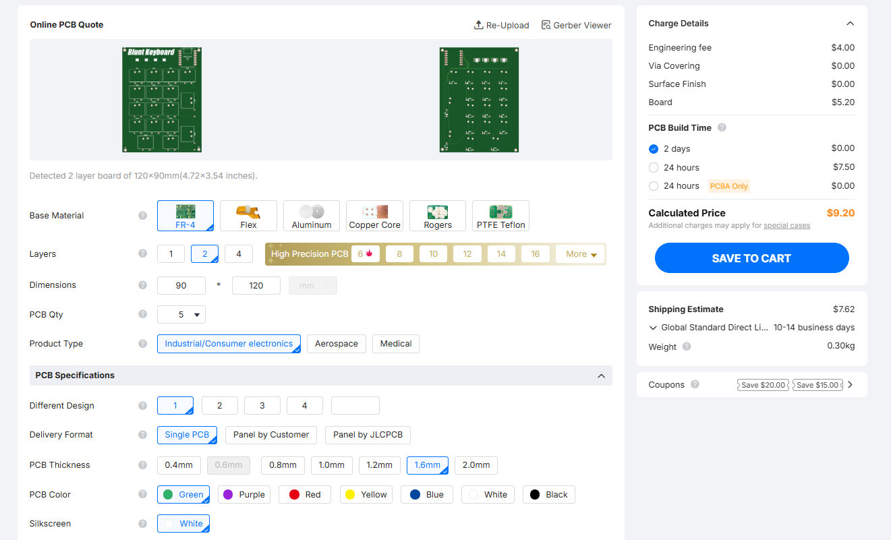

# Blunt-Keyboard

This keyboard is a 75% keyboard which has a magnetically attatchable numpad to it. It uses a raspberry pi pico rp2040 as the microcontroller for the main keyboard while using a xiao seeed studio rp2040 as the microcontroller for the numpad. This would connect via two usb C cables into my pc. I made this because I really need a new keyboard since my current one cant even play games anymore due to some weird bug in the pcb where it just randomly spams keys, plus I've had it for almost 10 years.
### Numpad Render

### Main Keyboard Render

### Full Assembled Render

### PCB Layout Pad

### Pad Schematic

### Main PCB Layout

### Main Schematic

### Bill of Materials

### Main PCB Order

### PAD PCB Order

